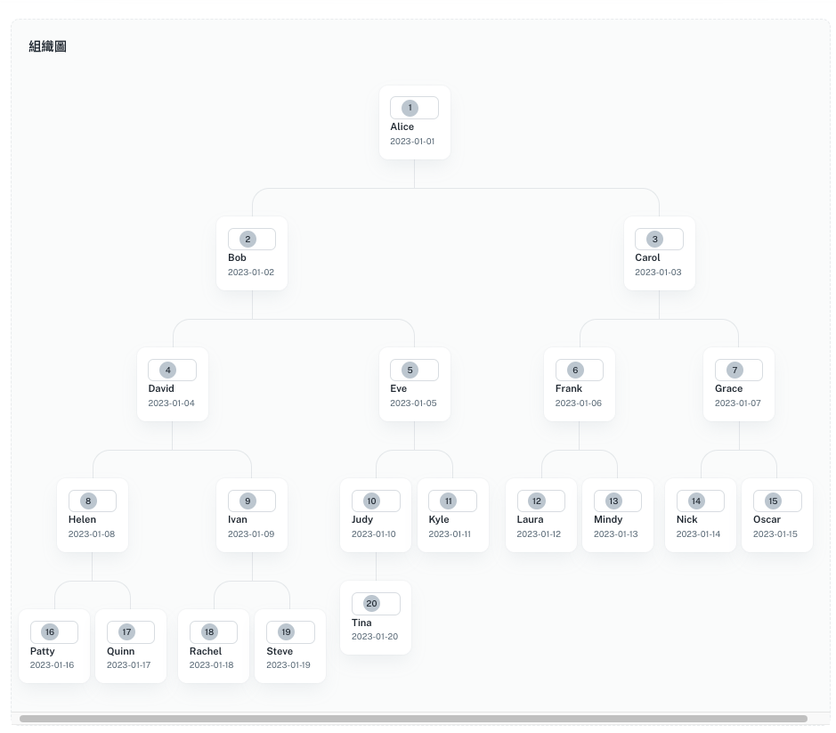

# 組織圖ＡＰＩ實作

資料的結構如下：


```bash
policyholder-api-ts/
├── src/
│   ├── app.ts
│   └── database.ts
│   └── setupDatabase.ts
├── mydatabase.db
├── package.json
├── tsconfig.json

```

```bash
cd  policyholder-api-ts
npm install 
```

啟動服務：

```bash
npm start
```

# 資料庫設計

數據庫schema，我們可以建立一個表來存儲個別節點（保戶）信息以及一個表來存儲節點之間的關係（介紹）。分別創建以下表格：

1. **Policyholders** - 存儲保戶的基本信息。
2. **Introductions** - 存儲保戶之間的介紹關係，包括直接和間接介紹。

### **表格設計**

### **Policyholders**

| Column Name | Data Type | Description |
| --- | --- | --- |
| policyholder_id | TEXT | 保戶的唯一識別碼 |
| name | TEXT | 保戶姓名 |
| registration_date | timestamp | 註冊日期 |

### **Introductions**

| Column Name | Data Type | Description |
| --- | --- | --- |
| introducer_id | TEXT | 介紹人的保戶識別碼 |
| introduced_id | TEXT | 被介紹人的保戶識別碼 |
| introduction_type | CHAR(1) | 介紹類型（'D' 直接, 'I' 間接） |
| relationship | CHAR(1) | 介紹方向（'L' 左, 'R' 右） |

> 使用sqlite3 創建資料庫(mydatabase.db)，創建語法請參閱setupDatabase.ts
> 

# 組織圖

依據資料關聯前端畫面如下：



# API 實作

### 保戶查詢

Method: GET
[http://localhost:3000/api/policyholders?code=](http://localhost:3000/api/policyholders?code=1)3

```bash
{
    "code": "3",
    "name": "Carol",
    "registration_date": "2023-01-03",
    "introducer_code": "1",
    "l": [
        {
            "code": "6",
            "name": "Frank",
            "registration_date": "2023-01-06",
            "introducer_code": "3"
        },
        {
            "code": "12",
            "name": "Laura",
            "registration_date": "2023-01-12",
            "introducer_code": "6"
        },
        {
            "code": "13",
            "name": "Mindy",
            "registration_date": "2023-01-13",
            "introducer_code": "6"
        }
    ],
    "r": [
        {
            "code": "7",
            "name": "Grace",
            "registration_date": "2023-01-07",
            "introducer_code": "3"
        },
        {
            "code": "14",
            "name": "Nick",
            "registration_date": "2023-01-14",
            "introducer_code": "7"
        },
        {
            "code": "15",
            "name": "Oscar",
            "registration_date": "2023-01-15",
            "introducer_code": "7"
        }
    ]
}
```

### 保戶上層查詢

Method: GET

http://localhost:3000/api/policyholders/10/top

```bash
{
    "code": "5",
    "name": "Eve",
    "registration_date": "2023-01-05",
    "introducer_code": "2",
    "l": [
        {
            "code": "10",
            "name": "Judy",
            "registration_date": "2023-01-10",
            "introducer_code": "5"
        },
        {
            "code": "20",
            "name": "Tina",
            "registration_date": "2023-01-20",
            "introducer_code": "10"
        }
    ],
    "r": [
        {
            "code": "11",
            "name": "Kyle",
            "registration_date": "2023-01-11",
            "introducer_code": "5"
        }
    ]
}
```
